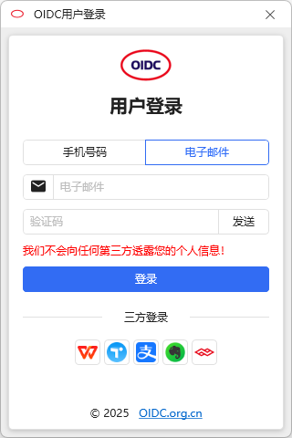
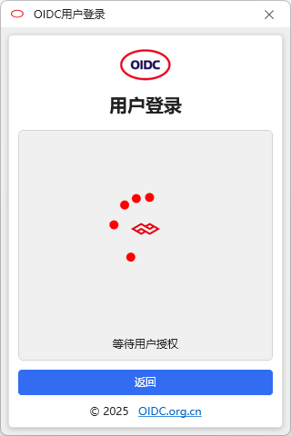
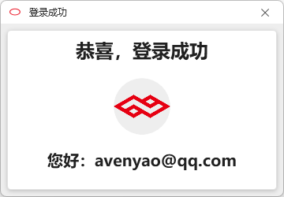
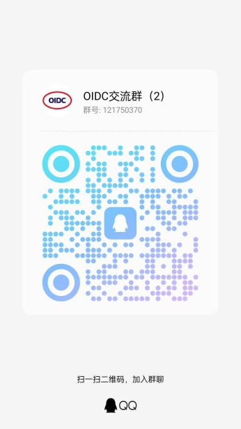

# Scm.Oidc

#### 介绍
OIDC(OpenID Connect)：简单、易用的多平台联合登录系统。  
OIDC同时支持OAuth1.0、OAuth2.0协议，支持国内外近百家大型网站的登录与授权：  
支付宝、阿里云、Apple Inc.、百度、Coding、钉钉、抖音、Facebook、飞书、Gitee、Github、GitLab、Google、华为、京东、快手、领英、美团、小米、微软、OSChina、QQ、微博、StackOverflow、Teambition、微信、WPS、小红书、迅雷、OPPO、Vivo、荣耀、印象笔记、开放原子、魅族、360、Evernote、Amazon、Slack、Yahoo、X、Yandex、VK.ru、Ok.ru、Mail.ru、DCloud、Notion、Figma、Atlassian、Line、Linear、Zoom、Discord、Bitbucket、Adobe、Dropbox、Zoho、Box、Todoist、Tower，更多支持还在持续更新中……   

您是否遇到过这样的场景？ 

1.  由于应用/网站太多，根本记不住每个应用/网站的用户和密码信息？ 
2.  很多网站使用相同的用户/密码，很不安全，有没有更好的解决方案？ 
3.  我的应用程序需要使用第三方登录功能，一个个集成太过于麻烦？ 
4.  某些大的应用/网站的开放平台需要严苛的身份资质，而且注册认证成本过高？ 
5.  使用三方的密码管理软件，又担心重要信息出现泄露？ 
6.  其它更多场景…… 

那有没有一个更简易的解决方案？

这就是OIDC所要解决的问题，我们致力于为用户提供一个简单易用的三方授权认证平台，让用户免去高强度记忆用户和密码的烦恼。

OIDC的特点： 
1.  基于OAuth协议；  
2.  不记忆用户隐私数据；  
3.  支持多平台身份认证/授权；   
4.  拿来即用，用完即走，不增加用户负担。  

在这里，你可以使用多个平台的身份认证/授权的功能，而不需要花费巨量精力去单独对接各个平台。 

#### 软件架构
此项目是OIDC（OpenID Connect）官网的.Net使用案例，包含服务端和客户端的示例代码，用于向使用者演示如何快速调用OIDC的服务，并为终端用户提供一个简单易用的用户登录功能。

服务端效果：  
请移步这里查看演示：[演示链接](http://demo.oidc.org.cn)

客户端效果：  
  
  
  

QQ沟通群：  
  
