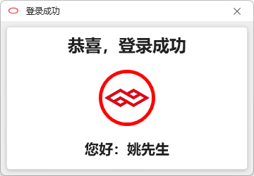

# Scm.Oidc

#### 介绍
简单、易用的多平台联合登录系统。

您是否遇到过这样的场景？
1、由于应用/网站太多，根本记不住每个应用/网站的用户和密码信息？
2、很多网站使用相同的用户/密码，很不安全，有没有更好的解决方案？
3、我的应用程序需要使用第三方登录功能，一个个集成太过于麻烦？
4、某些大的应用/网站的开放平台需要严苛的身份资质，而且注册认证成本过高？
5、使用三方的密码管理软件，又担心重要信息出现泄露？
6、其它更多场景……

那有没有一个更简易的解决方案？

这就是OIDC所要解决的问题，我们致力于为用户提供一个简单易用的三方授权认证平台，让用户免去高强度记忆用户和密码的烦恼。

OIDC的特点：
1、基于OAuth协议；
2、不记忆用户隐私数据；
3、支持多平台身份认证/授权；
4、拿来即用，用完即走，不增加用户负担。
在这里，你可以使用多个平台的身份认证/授权的功能，而不需要花费巨量精力去单独对接各个平台。

#### 软件架构
此项目是OIDC官网的使用案例，包含服务端和客户端的示例代码，用于向使用者演示如何快速调用OIDC的服务，并为终端用户提供一个简单易用的用户登录功能。
服务端效果：
请移步这里查看演示：

客户端效果：

